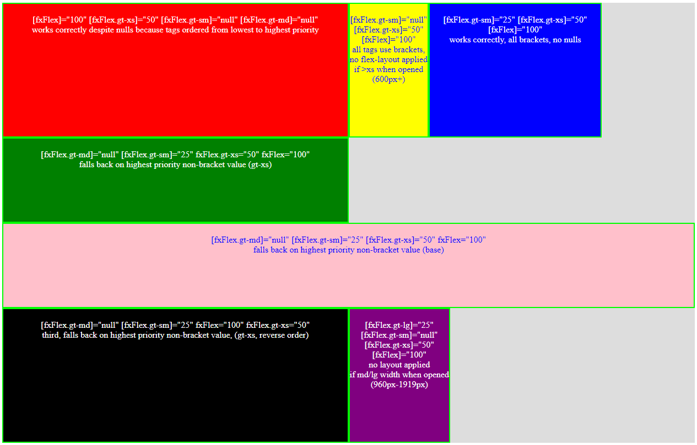
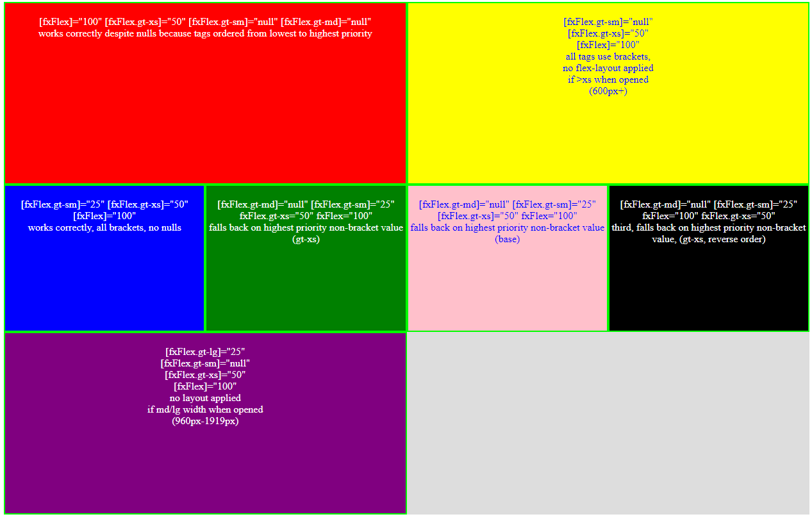

# FlexLayoutIvy

This project was generated with [Angular CLI](https://github.com/angular/angular-cli) version 9.0.3.

It displays the new behavior present with Angular 9 Ivy compiler which makes the addition of responsive flex-layout directive tags order-sensitive under certain conditions. 

Specifically, if the following is true:
* a template element has multiple responsive directive tags added
* the tags are ordered from highest priority to lowest priority rather than lowest to highest (e.g. ordered gt-xl, gt-lg, gt-md, gt-sm, gt-xs, base)
* at least one of the higher priority non-null tags are specified using brackets for Angular to compute the value, rather than just using a String
* at least one of the higher priority directive tags is set to null, undefined, or empty

Then, when the application is first opened, if the null/undefined/empty tag would apply, the display will instead default to the lowest level tag specified with a String, ignoring any computed tags.  If all the tags are computed (all in brackets), no layout style will be applied!

Note that if the window is manually resized to hit one of the non-null breakpoints and then resized back, it will display as expected.

Incorrect layout if opened when window is "large" or wider (>1280px):  

Expected layout:  

